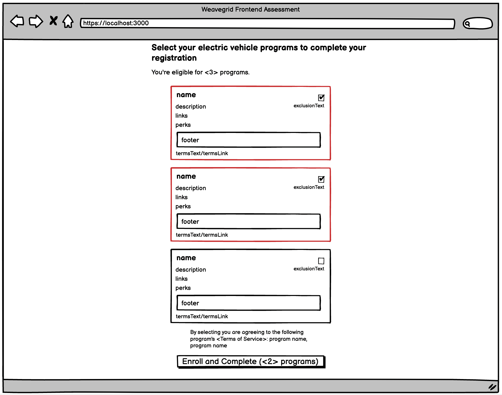

# Weavegrid Frontend Assessment

## Introduction

The purpose of this exercise is to give you the chance to show us what you're made of! We know you can code, but we want to see where you fit and really shine! We want to understand both your coding style and your documentation patterns. If these criteria don’t seem like the right test of your specific skills, please let us know and we can consider how to tailor the exercise or get you into the right position!

The full evaluation criteria are provided below. We welcome your feedback on the exercise, as well as creative solutions. We are happy to accommodate changes in the test format based on your specific context.

## The Exercise

We work with many utilities, but as you may or may not know, utilities frequently span many states. Sometimes utilities have different programs for different areas, or many programs within the same area. This means to support our various EV charge management rebate and charging discount programs, we have to build a page in our sign-up flow for the end user to select which programs they want to participate in.

- create a select-programs page similar to the mockup in `public/mockup.png` that uses the data from `/api/programs` to build a page that dynamically creates checkboxes for each program
- allow the user to select programs, and click the button at the bottom to submit this form via POST to the /api/enroll endpoint
- programs will mostly have the same data, but some of them have more than others
- some of these programs are mutually exclusive, so design the component to automatically handle this

When you're done, commit this work to a GitHub repo! Ensure the github repository contains your complete work including your completed README.md file and deliver a link to us via email. When we receive your link, we will provide you with github usernames to invite to your repository.



## Assessment Criteria

What we’re looking for in your code:

- Linting — Does it have correct indentation, spelling, import order, eg. as identified by a tool like esLint: https://eslint.org or any automated linter?
- Testing — Does it have tests that meaningfully verify the expected behavior?
- Maintainability — Abstractions, comments, naming, control flow, does the code seem well-factored?
- Accessibility — Does it use appropriate tags, markup and design?
- Performance — How fast should this page be, how could we make it faster?
- Security — How do you think about security in your codebase?
- Documentation — Are instructions provided on how to build & run app, and run tests, with appropriate context on how the app works?

Extra Credit

- You can earn extra points by going deep on any of the above dimensions or showing special interest in some other dimension that you care about. We welcome your unique perspective!
- The “app” you build should not feel complete or fully designed — you don’t need to make it beautiful, we have people for that!

## Time Expectations

Please don’t spend more than _3 hours maximum_ on the entire exercise. If you have concerns about the time needed, please don’t hesitate to reach out with questions. Our goal is to understand enough about your coding strategy so you will be able to demonstrate some of your best practices when we next meet in person!

## Getting Started

This is a [Next.js](https://nextjs.org/) project bootstrapped with [`create-next-app`](https://github.com/vercel/next.js/tree/canary/packages/create-next-app).

First, run the development server:

```bash
npm run dev
# or
yarn dev
```

Open [http://localhost:3000](http://localhost:3000) with your browser to see the result.

You can start editing the page by modifying `pages/index.tsx`. The page auto-updates as you edit the file.

[API routes](https://nextjs.org/docs/api-routes/introduction) The `pages/api` directory is mapped to `/api/*`. Files in this directory are treated as [API routes](https://nextjs.org/docs/api-routes/introduction) instead of React pages.

## Learn More

To learn more about Next.js, take a look at the following resources:

- [Next.js Documentation](https://nextjs.org/docs) - learn about Next.js features and API.
- [Learn Next.js](https://nextjs.org/learn) - an interactive Next.js tutorial.

You can check out [the Next.js GitHub repository](https://github.com/vercel/next.js/) - your feedback and contributions are welcome!

## Deploy on Vercel

The easiest way to deploy your Next.js app is to use the [Vercel Platform](https://vercel.com/new?utm_medium=default-template&filter=next.js&utm_source=create-next-app&utm_campaign=create-next-app-readme) from the creators of Next.js.

Check out our [Next.js deployment documentation](https://nextjs.org/docs/deployment) for more details.
